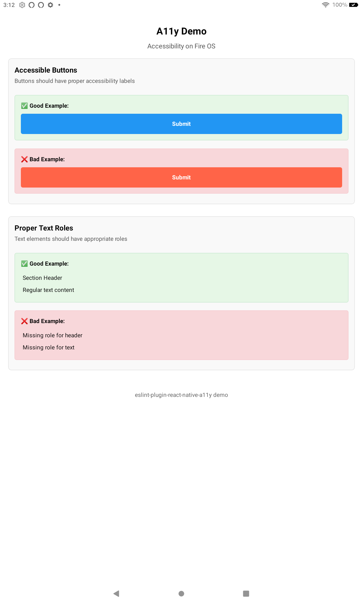

# eslint-plugin-react-native-a11y Demo

This is a demonstration app for testing and visualizing the [eslint-plugin-react-native-a11y](https://github.com/FormidableLabs/eslint-plugin-react-native-a11y) linting rules.



## Features

- Visual examples of accessibility rules with good and bad implementations
- Demonstration of how ESLint detects accessibility issues
- Interactive UI showing what each rule checks for

## Running the Demo

1. Start the Expo development server:
   ```
   npm start
   ```

2. Run ESLint to see accessibility issues:
   ```
   npm run lint
   ```

3. Run ESLint on the example file with intentional errors:
   ```
   npx eslint LintExample.js
   ```

## Demonstrated Rules

This app demonstrates the following accessibility rules:

- `has-accessibility-props`: Enforces that elements have proper accessibility props
- `has-valid-accessibility-component-type`: Ensures valid accessibilityRole values
- `accessible-image-has-label`: Requires images to have accessibility labels
- `has-accessibility-hint`: Enforces accessibility hints on interactive elements
- `touchable-has-alt`: Requires touchable elements to have accessibility text
- `has-valid-accessibility-actions`: Ensures proper formatting of accessibility actions
- `no-nested-touchables`: Prevents nesting of touchable elements
- `accessibility-label-has-string-literal`: Enforces string literals for accessibility labels

## Project Structure

- `App.js`: Main application with visual examples of each rule
- `LintExample.js`: File with intentional accessibility errors to demonstrate linting
- `.eslintrc.js`: ESLint configuration with react-native-a11y rules
